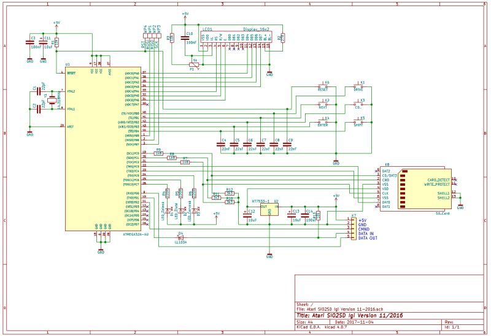
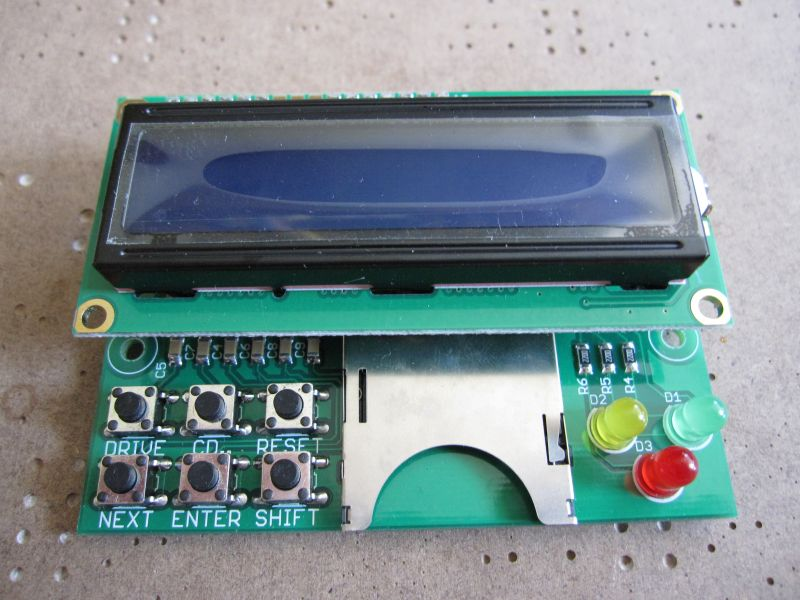
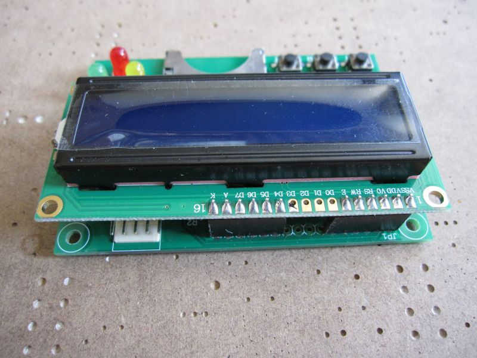
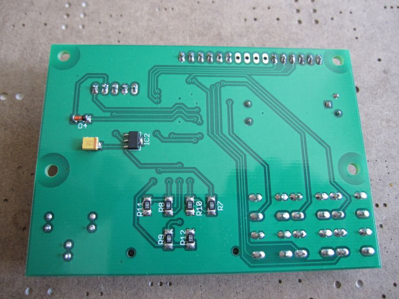
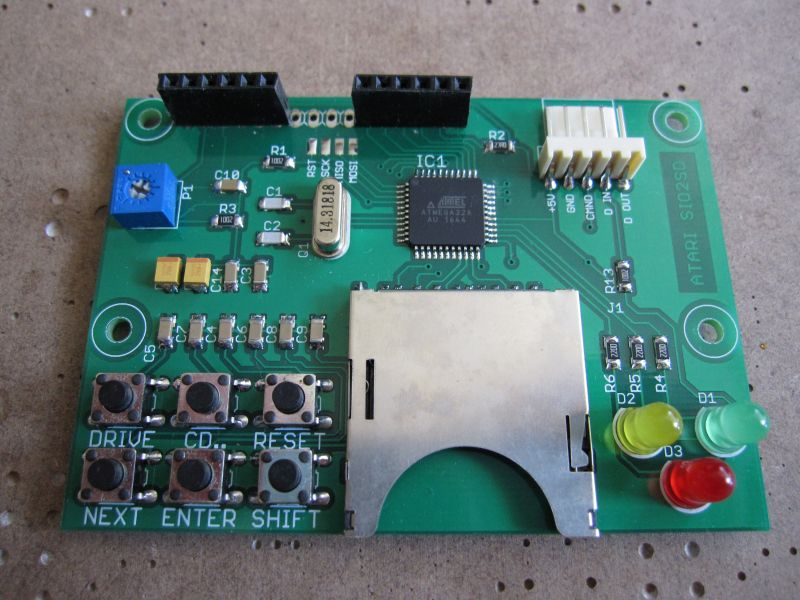
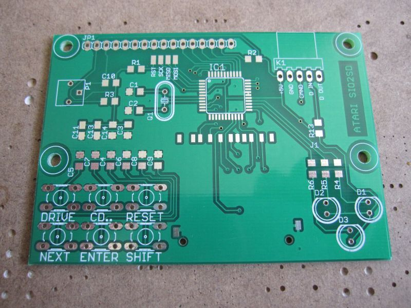
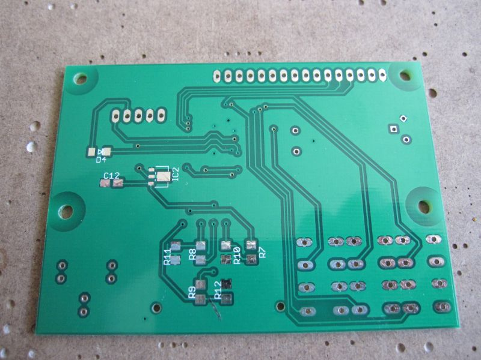

# Atari SIO2SD Igi Version

SIO2SD je zařízení, které vám umožní nahrávat programy a hry do Atari přes SIO konektor z SD/MMC karty. 

  

## Seznam součástek:

| Ref                      | Qnty | Value                       | Cmp name                    |
|--------------------------|------|-----------------------------|-----------------------------|
| C1, C2,                  | 2    | 22pF                        | C_1206                      |
| C9, C8, C7, C6, C5, C4,  | 6    | 22nF                        | C_1206                      |
| C11, C13, C12,           | 3    | 10uF                        | C_Tantal_A/3216             |
| C14, C3, C10,            | 3    | 100nF                       | C_1206                      |
| D1,                      | 1    | LED_Zelená                  | LED_5mm_Zelená              |
| D2,                      | 1    | LED_Žlutá                   | LED_5mm_Žlutá               |
| D3,                      | 1    | LED_Červená                 | LED_5mm_Červená             |
| D4,                      | 1    | LL103A                      | LL103A                      |
| K1,                      | 1    | DRIVE                       | Mikrospínač_6x6x5mm         |
| K2,                      | 1    | NEXT                        | Mikrospínač_6x6x5mm         |
| K3,                      | 1    | CD..                        | Mikrospínač_6x6x5mm         |
| K4,                      | 1    | ENTER                       | Mikrospínač_6x6x5mm         |
| K5,                      | 1    | SHIFT                       | Mikrospínač_6x6x5mm         |
| K6,                      | 1    | RESET                       | Mikrospínač_6x6x5mm         |
| K7,                      | 1    | KF2510-5_Angled_Pitch2.54mm | KF2510-5_Angled_Pitch2.54mm |
| K8,                      | 1    | SD_Card                     | SD_Card                     |
| LCD1,                    | 1    | Display_16x2                | Display_16x2                |
| P1,                      | 1    | 5k                          | 3362P                       |
| R1, R3, R13,             | 3    | 10k                         | R_1206                      |
| R2,                      | 1    | 27R                         | R_1206                      |
| R4, R6, R5,              | 3    | 220R                        | R_1206                      |
| R9, R8, R7,              | 3    | 1k8                         | R_1206                      |
| R11, R12, R10,           | 3    | 3k3                         | R_1206                      |
| U1,                      | 1    | ATMEGA32A-AU                | ATMEGA32A-AU                |
| U2,                      | 1    | HT7533-1                    | HT7533-1                    |
| WP1,                     | 1    | MOSI                        | Wire_Pad                    |
| WP2,                     | 1    | MISO                        | Wire_Pad                    |
| WP3,                     | 1    | SCK                         | Wire_Pad                    |
| WP4,                     | 1    | RST                         | Wire_Pad                    |
| Y1,                      | 1    | 14.318MHz                   | Krystal_HC49-U_Vertical     |

## Fotky hotového výrobku (DPS verze 1):

## Původní autoři zařízení jsou:
Device inventor and AVR software developer: Jakub Kruszona-Zawadzki 
ATARI software developer and tester: Paweł Nowak (Pajero/MadTeam) 
NVC developer: Marcin Sochacki (Montezuma) 
Tester (also new SMD PCB designer - still not finished): Jakub Husak 

Tato verze má vylepšené a zjednodušené zapojení od [Igiho](http://blog.3b2.sk/igi/post/SIO2SD-3verzia.aspx).
Otestováno na Atari 800XE a vše funguje bez problému.
